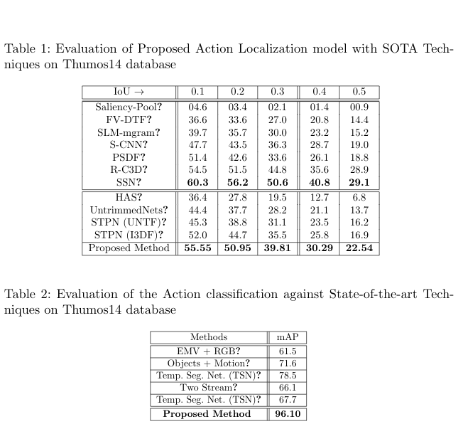

# Supplementary material for Action Localization and Recognition using C3D and Localization Model (Student Abstract)
Table 1: Evaluation of Proposed Action Localization model with SOTA Tech-niques on Thumos14 database

